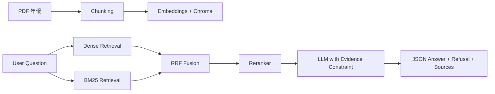

# 富邦年報 RAG 問答系統
## 模型成效與優化歷程報告

StudyWithWoody  
2026 MA Interview Presentation

<!--
開場先講一句：本報告聚焦「可驗證正確率 + 幻覺治理 + 金融落地價值」
-->

---
layout: section
---

# 1. Executive Summary

---

# Executive Summary

- **目標**：建立可回答富邦 113 年報問題的 RAG 系統，並可量化驗證
- **方法**：Baseline（TF-IDF）→ LangChain Hybrid Retrieval + Rerank + Refusal 機制
- **結果**：整體正確率（relaxed）由 **0.10 提升至 0.50**
- **風險現況**：拒答能力仍是主要短板（refusal F1 尚待提升）
- **價值**：已具備「可查證、可追溯、可持續優化」的金融知識問答雛型

<!--
一句話結論：我不是只追求答得出來，而是追求答得對、答得有證據、該拒答就拒答。
-->

---
layout: section
---

# 2. 題目理解與成功定義

---

# 題目理解與成功定義

## 任務本質
- 建立以 **富邦 113 年報** 為知識來源的 RAG 問答系統
- 目標不是單純 QA，而是 **高可信問答**（High-Trust QA）

## 題目要求（評分核心）
- 使用附件題庫驗證，計算 **Accuracy**
- 回答需提供來源依據（頁碼/段落）
- 需檢測並排除 **Hallucination**

## 題型挑戰
- 基本題 19：單點/複合查找
- 加分題 8：跨頁關聯、歸納整理
- 困難題 3：計算推理、幻覺檢測

## 成功定義
- **正確性**：答案與標準答案一致（或語意等價）
- **可驗證性**：來源可對照
- **安全性**：資料不足時明確拒答
- **可解釋性**：能說明方法取捨與改進邏輯

<!--
這頁重點是把「主管關心什麼」先講清楚，後面每頁都扣回這四個成功定義。
-->

---
layout: section
---

# 3. 資料與評測設計

---

# 資料與評測設計

## 資料來源
- 富邦金控 113 年報 PDF
- 附件問答集（30 題）與標準答案、來源頁碼

## 評測流程
Question → Retrieval → Generation → Judge → Metrics

## 核心指標
- Accuracy（strict / relaxed）
- Refusal precision / recall / F1
- Citation coverage（是否提供可查證來源）
- Retrieval recall@20、final context hit rate（檢索層追蹤）

---
layout: section
---

# 4. Baseline（起點）

---

# Baseline 架構與限制

## Baseline 設計
- PDF 解析 + 固定長度切塊（chunk）
- TF-IDF 檢索（Top-k）
- 門檻式拒答
- 規則式答案比對

## 優點
- 快速建立可執行流程
- 可產生初始評測基準

## 限制
- 跨頁資訊整合能力弱
- 複合題與推理題表現差
- 拒答策略偏粗糙，容易過拒或誤答

---

# Baseline 成效（起點數據）

- 題庫總數：30
- Accuracy：**0.10**
- Citation coverage：**1.00**
- Refusal precision：**0.00**

> 結論：流程可用，但答對率與拒答品質不足，需升級為更強的檢索 + 生成架構

---
layout: section
---

# 5. 改善版 LangChain RAG

---

# 改善版系統架構

- 從「單一路徑檢索」升級為 **Hybrid Retrieval**
- 透過融合與重排提高候選證據品質
- 生成端強制遵守 evidence constraint

---

# 改善策略（對應痛點）

## Retrieval 層
- Dense + BM25 互補召回
- RRF 融合降低單一檢索偏差
- Rerank 提升最終上下文相關性

## Generation 層
- System prompt 規範：僅能依 context 作答
- 結構化輸出：`answer / refusal / reason / sources`

## Evaluation 層
- 三層評估（規則、語意、相似度）
- 可做錯誤分桶與迭代追蹤

---
layout: section
---

# 6. Hallucination 治理

---

# Hallucination 定義與治理機制

## 定義
- 回答包含文件中不存在資訊
- 或在證據不足下做過度推論

## 治理策略
- 檢索不足門檻：低證據時拒答
- 證據一致性：答案需可在來源片段對齊
- Post-check：檢查數值/關鍵事實是否可驗證

## 目標
- 「答對」與「不亂答」同時優化

---
layout: section
---

# 7. 成效比較

---

# Baseline vs Improved（目前結果）

- Accuracy（relaxed）：**0.10 → 0.50**
- Accuracy（strict）：**0.20**（Improved）
- Citation coverage：維持高覆蓋（1.00）
- Retrieval recall@20：**0.80**
- Final context hit rate：**0.60**

## 關鍵觀察
- 系統整體答題能力明顯提升
- 但拒答能力仍不足（refusal F1 尚未達標）
- rerank gain 為負，顯示重排策略仍有優化空間

---
layout: section
---

# 8. 錯誤分析與下一步

---

# 錯誤分析與改進計畫

## 錯誤分桶
- Retrieval error：相關證據未進 final context
- Generation error：有證據但答案整合不完整
- Refusal error：該拒不拒 / 不該拒卻拒

## 下一步優化
1. 提升 refusal gate（特別是幻覺題）
2. 調整 rerank 策略與候選池參數
3. 強化 multi-hop / multi-fact 題型處理
4. 增加逐題診斷儀表板，縮短迭代週期

---
layout: section
---

# 9. 金融應用落地價值

---

# 金融業落地場景

## 可落地場景
- 投資人關係（IR）文件問答
- 內部法遵/稽核查詢輔助
- 客服知識輔助（有來源可追溯）

## 業務價值
- 降低人工查找時間
- 提升回覆一致性與可稽核性
- 降低錯答與法遵風險

## 導入 KPI（示例）
- 平均查詢時間（TTR）
- 可驗證回答率
- 高風險問題人工覆核率

---
layout: section
---

# 10. English Abstract

---

# English Abstract

**Problem**: Build a RAG system to answer questions from Fubon’s 2024 annual report with measurable accuracy and hallucination control.

**Method**: We built a baseline TF-IDF pipeline, then upgraded to a LangChain-based hybrid retrieval system (Dense + BM25 + RRF + reranking) with evidence-constrained generation and refusal handling.

**Results**: Relaxed accuracy improved from **0.10** to **0.50** on the 30-question benchmark, while citation coverage remained high.

**Impact**: The system provides a practical foundation for high-trust financial document QA with clear auditability and iterative optimization paths.

---
layout: end
---

# Thank You
## Q & A

