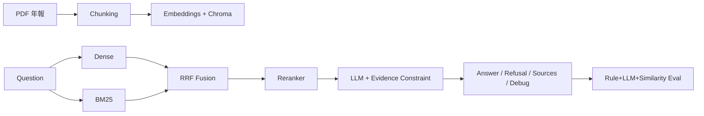
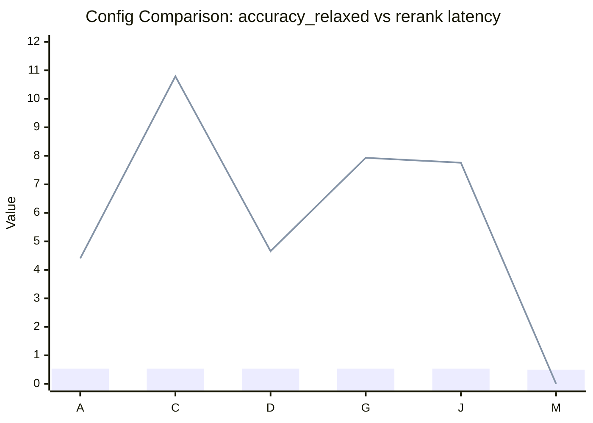

# 富邦年報 RAG 問答系統（v3）
## 模型成效、Rerank 實驗、Refusal Gate 優化報告

許峻瑋 (Chun-Wei Hsu)  
2026 MA Interview Presentation

---
layout: default
---

## 執行摘要（最新）

- 目標：打造可驗證、可追溯、可拒答的金融文件 QA 系統
- 結果：`accuracy_relaxed` 從 **0.10 → 0.5667**（30 題）
- 檢索：`retrieval_recall@20 = 0.80`，`final_k_hit_rate = 0.70`
- 拒答：P3 上線後 `refusal_f1` 從 **0.00 → 0.3333**
- 重點：Rerank 目前為「中性」(avg_rerank_gain_k = 0.0)，下一階段重點在拒答閘門與語義題聚合

---
layout: default
---

## Executive Summary (Latest)

- We built a high-trust RAG pipeline for Fubon annual-report QA.
- Relaxed accuracy improved from **0.10 to 0.5667** on the 30-question benchmark.
- Retrieval quality is stable (`recall@20=0.80`, `final_k_hit_rate=0.70`).
- After P3 gate rollout, refusal quality improved (`refusal_f1: 0.00 -> 0.3333`).
- Current bottleneck shifted from retrieval to refusal policy tuning and semantic-task aggregation.

---
layout: two-cols-header
---

# 題目理解與成功定義

::left::
## 任務本質
- 富邦 113 年報問答系統（RAG）
- 核心不是「答很多」，而是「答對、可查證、該拒答就拒答」

## 評分關鍵
- Accuracy（strict / relaxed）
- 拒答品質（precision / recall / F1）
- 可驗證性（citation coverage）

::right::

## 題型挑戰
- 單點事實題（數值/實體）
- 多欄位題（multi-fact）
- 摘要/策略題（semantic）
- 幻覺檢測題（該拒答）

## 成功定義
- Correctness
- Verifiability
- Safety (Refusal)
- Explainability

---
layout: default
---

# 評測框架（v3）

Question → Retrieval → Generation → Judge → Metrics

## 指標分層
- **Layer1 (Rule)**：strict/relaxed、coverage、numeric checks
- **Layer2 (LLM Judge)**：semantic/completeness/faithfulness
- **Layer3 (Similarity)**：診斷訊號

## 檢索指標（新）
- `retrieval_recall_at_20`
- `fusion_k_hit_rate`
- `final_k_hit_rate`
- `avg_rerank_gain_k`（公平比較 rerank 前後）

---
layout: default
---

# 系統架構（Improved Pipeline）

---
layout: default
---

# Baseline → Improved（總成效）

- Accuracy(relaxed): **0.10 → 0.5667**
- Accuracy(strict): **0.2333**（最新）
- Avg coverage: **0.5889**
- Citation coverage: **1.0**（維持）

## 解讀
- 問答能力已可用於原型展示
- 可驗證性穩定
- 剩餘風險集中在拒答邏輯與語義題聚合

---
layout: default
---

# Rerank 參數搜尋實驗（新增）

## 實驗設計
- 自動化 grid（14 組）
- 變因：
  - reranker type: heuristic / cross_encoder / fallback / none
  - candidate_pool: 12 / 20 / 30
  - top_k: 5 / 8
  - rrf_k: 20 / 60 / 100

## 主要比較指標
- `accuracy_relaxed`
- `final_k_hit_rate`
- `avg_rerank_gain_k`
- `avg_rerank_latency_ms`

---
layout: default
---

# Rerank 實驗結果重點（新增）

## 關鍵發現
- 最佳群組多落在：`top_k=8`、`pool=20` 附近
- `rrf_k` 在目前範圍影響有限
- `cross_encoder` 對 hit rate 有幫助，但整體增益多為中性
- `avg_rerank_gain_k = 0.0`：表示 rerank 未明顯拉升也未明顯拖累

## 目前建議運行設定
- `cross_encoder_fallback_heuristic`
- `candidate_pool = 12~20`
- `top_k = 8`
- `rrf_k = 60`

---
layout: default
---

# Config 比較圖（Accuracy vs Latency）

- Bar = `accuracy_relaxed`
- Line = `avg_rerank_latency_ms`
- A/C/D/G/J 為不同 config；M 為 no-rerank 對照組

<!--
口頭說明：目前 accuracy 天花板接近，但 latency 差異很大，代表可以用較低成本設定拿到近似效果。
-->

---
layout: default
---

# Config 比較表（可直接放截圖/貼圖）

| Config | rerank.type | pool | top_k | rrf_k | acc_relaxed | final_k_hit | latency(ms) |
|---|---:|---:|---:|---:|---:|---:|---:|
| A | heuristic | 12 | 5 | 60 | 0.5333 | 0.6667 | 4.403 |
| C | heuristic | 30 | 8 | 60 | 0.5333 | 0.7000 | 10.789 |
| D | cross_encoder | 12 | 5 | 60 | 0.5333 | 0.6667 | 4.657 |
| G | cross_encoder | 20 | 8 | 60 | 0.5333 | 0.7000 | 7.933 |
| J | cross_encoder_fallback_heuristic | 20 | 8 | 60 | 0.5333 | 0.7000 | 7.758 |
| M | none (no-rerank) | 20 | 5 | 60 | 0.5000 | 0.6000 | 0.003 |

資料來源：`langchain_rag/artifacts/experiments/latest_summary.csv`

## 可講結論
- `top_k=8` 可提高 final hit rate（0.70）
- 在 accuracy 同分下，`pool=12~20` 比 `pool=30` 更有效率
- 當前建議採 `J`（fallback）作為穩定預設

---
layout: default
---

# 為何改用 `fusion@k_hit vs final@k_hit` 量測 rerank

## 舊問題
- 舊指標拿 `recall@20` 對 `final@k`，難度不一致，容易偏負

## 新作法
- 同一個 k 下比較：
  - `fusion_k_hit`（rerank 前）
  - `final_k_hit`（rerank 後）
- `rerank_gain_k = final_k_hit - fusion_k_hit`

## 好處
- 公平、可解釋
- 可直接評估 reranker 是否真的改善排序
- 適合做不同 reranker 的 A/B 比較

---
layout: default
---

# P3：Evidence Sufficiency Gate（新增）

## 設計目標
把「拒答」從 prompt 行為，升級成可控決策：

1. 證據抽取（含頁碼）
2. 實體對齊（entity alignment）
3. 多子題覆蓋判定
4. 不通過即 force refusal

## 規則例
- 外部公司/超出資料範圍 → 強制拒答
- hard-fact 題無可核數值 → 強制拒答
- 子題覆蓋不足（< 門檻） → 強制拒答

---
layout: default
---

# P3 上線後成效（新增）

- `refusal_precision`: **0.25**
- `refusal_recall`: **0.50**
- `refusal_f1`: **0.3333**（從 0.0 提升）
- `gate_force_refusal_rate`: **0.0667**
- `over_refusal_by_gate`: **0.0333**
- `missed_refusal_after_gate`: **0.0333**

## 解讀
- Gate 已有效降低「完全失控拒答」
- 仍需調參以減少 over-refusal / missed-refusal

---
layout: default
---

# Semantic Pass Fix（本次更新重點）

## 為何要修
- 舊版存在兩個問題：
  1. **LLM pass 規則過嚴**（高分仍常被判 fail）
  2. **聚合邏輯不合理**（multi_fact 的語義訊號被吃掉）

## 修復方案（semantic_pass_fix_plan）
- 新增 `pass_calibrated`：用 semantic/completeness/faithfulness 加權判定
- `aggregate_three_layers()` 調整：
  - hard types 僅保留 numeric/entity
  - semantic types 納入 `summary_strategy + multi_fact`
- `semantic_task_pass` 指標改版：
  - 新增 summary / multifact 拆分與 conflict rate

---
layout: default
---

# Semantic Pass Fix 成效（最新）

- `final.semantic_task_pass`: **0.625**（已不再是 0）
- `final.semantic_task_pass_summary`: **0.3333**
- `final.semantic_task_pass_multifact`: **0.8**
- `final.semantic_rule_conflict_rate`: **0.0**
- `layer2.semantic_pass_rate`: **0.625**

## 解讀
- 語義題的評估公平性明顯改善
- multi_fact 的語義訊號已能正確反映在 final label
- 後續可更聚焦在 summary 題型與拒答邊界調參

---
layout: default
---

# 當前錯誤分布與主要瓶頸

## 仍常見錯誤
- 多子題回答不完整
- 摘要題語意聚合偏差
- 拒答邊界（有證據但被拒 / 無證據卻作答）

## 當前瓶頸排序
1. Refusal gate threshold tuning
2. Semantic task aggregation rule
3. Multi-fact query planning 強化

---
layout: default
---

# 下一步優化 Roadmap

## 短期（1~2 週）
1. P3.1：拒答門檻微調（entity / coverage / confidence）
2. 語義題 final label 聚合規則調整
3. 保持 rerank 設定穩定，避免過度掃參

## 中期（2~4 週）
1. P2 query planning（multi-fact 拆解）
2. Gate 與 query planning 串接
3. 建立逐題錯誤 dashboard（可視化）

---
layout: two-cols-header
---

# 金融業落地價值

::left::
## 場景
- IR 文件問答
- 法遵/稽核檢索輔助
- 內部知識庫問答

## 核心價值
- 降低查找成本
- 提升回答一致性與可稽核性
- 控制 hallucination 風險

::right::

## 監控 KPI（建議）
- Accuracy(strict/relaxed)
- Refusal F1
- 可驗證回答率
- 高風險問題人工覆核率
- 平均查詢耗時

---
layout: end
---

# Thank You
## Q & A
